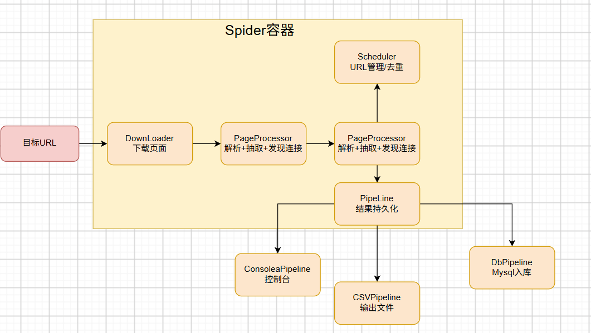
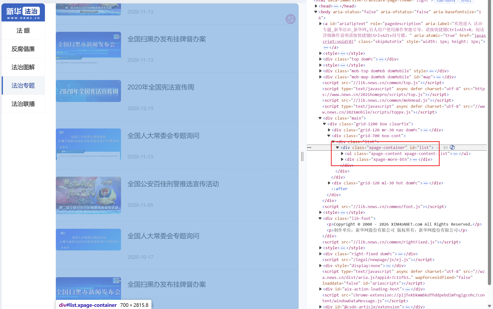
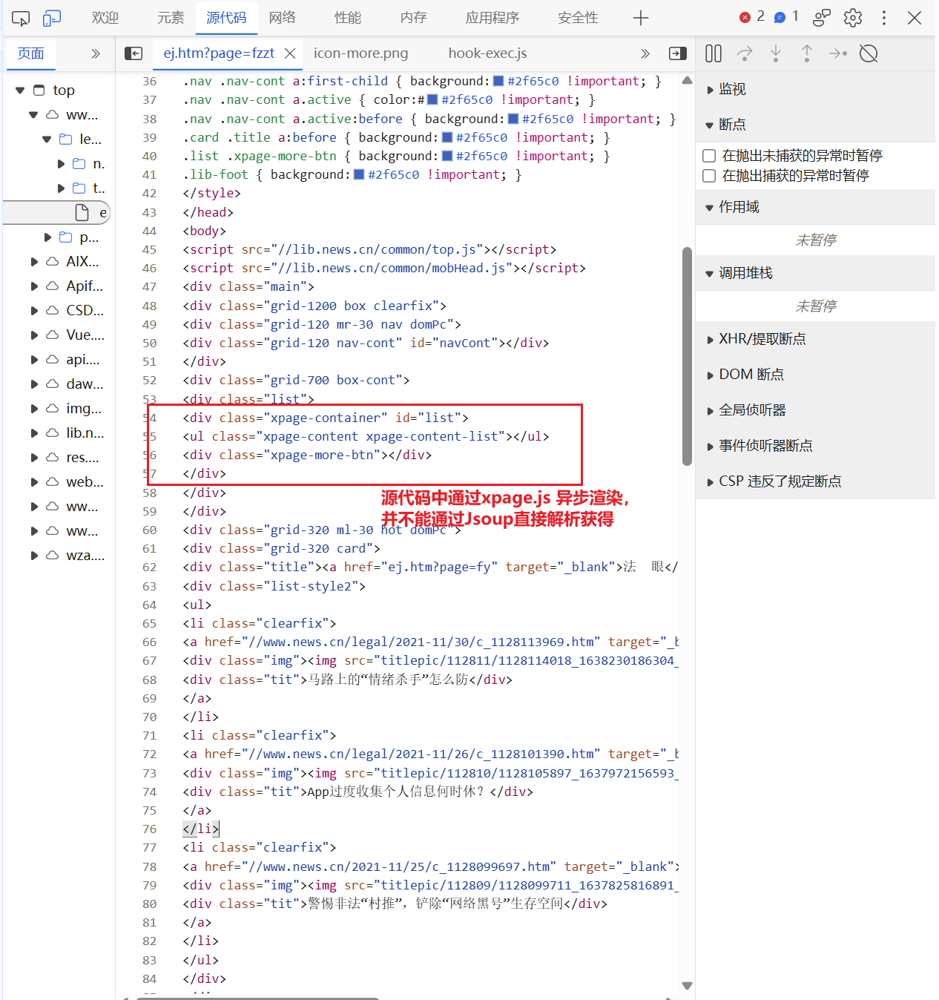
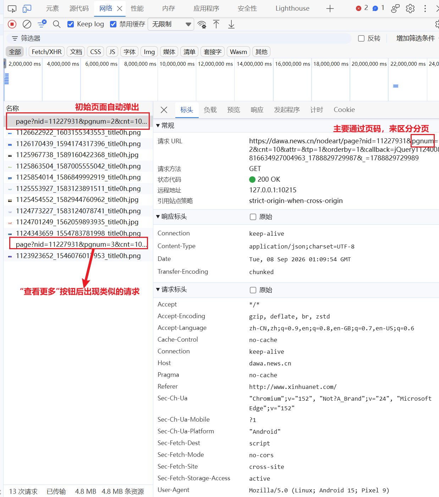
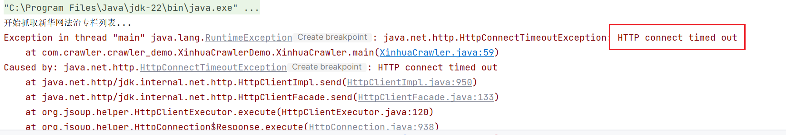

# 新华网法治专题爬虫 —— 学习与实践记录（LearningExp）

> 项目：`XH_crawlerDemo`
> 定位：面向"Java 爬虫开发"岗位要求的一次完整练手项目
> 目标站点：新华网法治专题栏目（列表由前端 xpage 组件通过 JSONP 接口异步加载）
> 技术栈：Java 21 · Spring Boot 3.5 · WebMagic 0.9.0 · MyBatis · MySQL 8 · Jackson
> 记录时间：2026 年 9 月

---

## 目录

1. [项目背景与目标](#一项目背景与目标)
2. [技术选型](#二技术选型)
3. [整体架构](#三整体架构)
4. [完成步骤](#四完成步骤)
5. [踩坑与解决记录](#五踩坑与解决记录)
6. [学习心得](#六学习心得)
7. [参考资料](#七参考资料)

---

## 一、项目背景与目标

本次练习的目标是做一个**垂直领域爬虫**：抓取新华网"法治专题"栏目的新闻列表（标题、发布时间、链接），并以多种形式输出（控制台 / CSV / MySQL 入库），整体做成一个 Spring Boot Web 应用，提供 REST 接口供查询与下载。

项目要求背后对应了几个爬虫开发的硬技能点：

| 要求 | 对应技能 |
| --- | --- |
| 栏目列表是 Ajax 异步加载的 | 需要绕过 HTML 直接抓数据接口，而不是抓页面 |
| 接口返回的是 JSONP 格式 | 需要正则剥离 `callback` 包裹，再解析 JSON |
| 数据要能持久化 | Pipeline 化输出：控制台 / CSV / MySQL 三选一或全选 |
| 涉及 HTTP 协议细节 | UA、Referer、超时、重试、代理的配置 |

一开始我对 WebMagic 完全不了解，所以学习路径是：**官方文档打底 → 社区教程补充 → 边写边查 → 踩坑复盘**。

---

## 二、技术选型

### 2.1 爬虫框架：为什么选 WebMagic

备选方案对比（这也是我在做选型时主要纠结的地方）：

| 方案 | 优点 | 缺点 | 结论 |
| --- | --- | --- | --- |
| **WebMagic** | 国产开源、中文文档完善、模块化（Downloader/PageProcessor/Scheduler/Pipeline）、上手快、支持多线程与代理 | 维护频率一般 | 适合学习 + 快速落地 |
| HttpClient + Jsoup 手写 | 灵活、依赖少 | 需要自己管理 URL 队列、去重、重试、多线程，代码量大 | 放弃：重复造轮子 |
| Selenium / Playwright | 能处理重度 JS 渲染 | 重、慢、需要浏览器环境 | 放弃：本场景数据接口是公开 JSONP，无需渲染 |

WebMagic 官方定位是"简单灵活的 Java 爬虫框架"，核心只有四个组件，覆盖爬虫的下载、解析、调度、持久化全流程。官方小书《WebMagic in Action》写得非常清楚，这是我最主要的参考资料。

### 2.2 其他技术选型

| 组件 | 选型 | 理由 |
| --- | --- | --- |
| 应用框架 | Spring Boot 3.5（Java 21） | 依赖管理、Bean 注入、REST 接口、配置绑定一站式解决 |
| 持久化 | MySQL 8 + MyBatis（注解式） | 表结构简单，注解式比 XML 更直观 |
| 入库去重 | `INSERT IGNORE` + `doc_id` 唯一索引 | 天然幂等：重复抓取自动跳过，符合爬虫"重复运行"场景 |
| JSON 解析 | Jackson（fastjson 也在依赖里，但统一用 Jackson） | Spring Boot 默认集成，树模型 `readTree` 适合动态结构 |
| 页面/接口解析 | 正则表达式 | JSONP 剥离和页码提取场景，正则最直接 |

>  选型依据查阅：
> - WebMagic 官网与中文文档：https://webmagic.io/ 、https://webmagic.io/docs/zh/
> - WebMagic 四大组件架构说明：https://webmagic.io/docs/en/posts/ch1-overview/architecture.html
> - 社区对 WebMagic 组件的拆解：https://blog.csdn.net/qq_38628046/article/details/126444200

---

## 三、整体架构

WebMagic 的核心架构是四组件 + Spider 容器（这部分我在官方文档和 CSDN 的源码分析文章里对照着看的）：



本项目中的对应实现：

| WebMagic 组件 | 本项目实现 | 说明 |
| --- | --- | --- |
| `PageProcessor` | `XinhuaLegalCrawler`（同时是 `@Service`） | 解析 JSONP、剥离 callback、提取标题/时间/链接 |
| `Spider` | `XinhuaLegalCrawler.crawl()` 内创建 | 一次抓 3 页（第 1~3 页），单线程 |
| `Pipeline` × 3 | `ConsolePipeline` / `CsvPipeline` / `DbPipeline` | 三种输出解耦，Spider 逐条消费 |
| `Downloader`（代理） | `HttpClientDownloader` + `SimpleProxyProvider` | 本机有代理时走本地转发端口，`crawler.proxy.*` 可配 |

>  架构与代理配置查阅：
> - Spider 的配置、启动与终止：http://webmagic.io/docs/zh/posts/ch4-basic-page-processor/spider-config.html
> - 代理设置方式（`setProxyProvider` + `SimpleProxyProvider`）：https://blog.csdn.net/weixin_51375107/article/details/128156772
> - WebMagic 代理实战：https://blog.csdn.net/Piconjo/article/details/105155491

---

## 四、完成步骤

### 4.1 环境与依赖

- JDK 21（IDEA 2023.2，Maven 3.9.9）
- MySQL 8.3（本机，库 `xinhua_crawler`，表 `legal_news`，`doc_id` 建唯一索引 `uk_doc_id`）
- `pom.xml` 核心依赖：`spring-boot-starter-web`、`mybatis-spring-boot-starter`、`mysql-connector-j`、`webmagic-core 0.9.0`

### 4.2 数据接口观察

刚开始我以为直接抓 `http://www.xinhuanet.com/legal/ej.htm?page=fzzt` 这个栏目页就行，



但用浏览器开发者工具一看：**列表是 JS 异步加载的**，页面 HTML 里根本没有新闻条目。



进一步抓包发现真实数据来自一个 JSONP 接口：

```
https://dawa.news.cn/nodeart/page?nid=11227931&pgnum={页码}&cnt=10&attr=&tp=1&orderby=1&callback=cb
```



返回形如 `cb({...})` 的 JSONP 包裹。这就验证了选型时的判断：**必须直连数据接口，而不是抓页面 HTML**。这一步是本次项目最重要的"调研"，决定了整个抓取方案。

### 4.3 核心抓取逻辑（PageProcessor）

`XinhuaLegalCrawler` 实现 `PageProcessor`，核心三件事：

1. **正则剥离 JSONP 包裹**：`^[^(]*\((.*)\)\s*$`，取最外层括号内内容，兼容纯 JSON 直出；
2. **Jackson 解析**：`root.path("data").path("list")` 遍历列表，取 `DocID / Title / PubTime / LinkUrl`；
3. **HTML 实体解码**：标题里带 `&ldquo;` `&rdquo;` 等实体，写了 `decodeHtmlEntities()` 统一转换。0


<u></u>

**关于正则表达式编写，由于太久没有编写，借助AI帮忙写了，具体为什么这样写:**

**利用贪婪匹配，天然跳过所有内层括号，只剥最外层**。我们一步步来。

先看它要处理的数据长什么样

真实接口返回（JSONP）：

```
cb({"data":{"list":[{"DocID":1128084990,...}]}})
```

结构是：**callback 名 + 一对最外层括号 + 里面是完整的 JSON**。而 JSON 内部又充满了 `{ }`、`[ ]`、`" "`。我们的目标：把最外层括号剥掉，拿到纯 JSON。

正则逐段拆解

```
Pattern.compile("^[^(]*\\((.*)\\)\\s*$", Pattern.DOTALL)
```

| 片段     | 含义                                                  |
| -------- | ----------------------------------------------------- |
| `^`      | 从头开始                                              |
| `[^(]*`  | 匹配**任意个不是 `(` 的字符** → 吃掉 callback 名 `cb` |
| `\(`     | 匹配第一个左括号 `(`（`(` 在正则里要转义）            |
| `(.*)`   | **捕获组 1**：任意字符，贪婪匹配                      |
| `\)`     | 匹配右括号 `)`（转义）                                |
| `\s*`    | 允许尾部空白 / 换行                                   |
| `$`      | 到串尾                                                |
| `DOTALL` | 让 `.` 也能匹配**换行符**（JSON 可能跨行）            |

 

核心 trick：`(.*)` 贪婪 + 最后一个 `)`

这是最值得记住的一点。`.*` 是**贪婪**的，它会一直吃、吃到**最后一个**能让它整体匹配成功的 `)`。

用真实数据走一遍：

```
cb({"data":{"list":[{"DocID":...}]}})
│  └─────── (.*) 贪婪吃掉这一整段 ───────┘
^[^(]*   \(                                \)\s*$
```

- `[^(]*` 吃 `cb`，遇到 `(` 停下
- `\(` 匹配第一个 `(`
- `(.*)` 贪婪吃下 `{"data":{"list":[...]}}`—— 它**先吃到串尾**，然后回溯到**最后一个 `)`** 停下
- `\)` 匹配最后那个 `)` → 整体 `matches()` 成功
- `group(1)` = `{"data":{"list":[...]}}`，纯 JSON 到手
- 

**为什么不怕内层括号？** 因为贪婪的 `.*` 总是吃到最后，`\)` 匹配的必然是**最后一个**右括号 —— 而 JSONP 的最外层右括号恰好就是最后一个。中间 `{...}` 里的括号再多也不影响，全被 `(.*)` 吞掉了。

再验证一个刁钻例子 ——JSON 字符串值里也有右括号：

```
cb({"title":"你好)"})
```

`(.*)` 照样吃到**最后一个** `)`，剥出来是 `{"title":"你好)"}`。正确。


**为什么用 `matches()` 而不是 `find()`**

`matches()` 要求**整个串**都匹配正则。这样：

- 匹配成功 → 确认是 `cb(...)` 包裹 → 取 `group(1)`
- 匹配失败 → 说明不是 JSONP（比如服务端偶尔直接返回纯 JSON `{"data":...}`）→ 原样返回 `jsonp.trim()`

一句话：**是包裹就剥，不是包裹就当纯 JSON 用**。兼容两种响应格式。

**为什么 `[^(]*` 而不是 `.*?`**

`[^(]*` 精确限定 "callback 名里不含左括号"，所以它天然停在第一个 `(` 前，不会误吞。如果 JSON 的字符串值里出现 `(`（如 `"abc(x"`），`[^(]*` 会停在**第一个** `(`，配合贪婪 `(.*)` 依然能正确剥出最外层 —— 这就是这个写法比 `indexOf("(")` 更稳的地方之一


------

`Site` 配置了 UA、Referer、超时 15s、重试 2 次、间隔 500ms，并按要求支持代理开关。

### 4.4 三种输出管线（Pipeline）

| Pipeline | 行为 |
| --- | --- |
| `ConsolePipeline` | 逐条打印到控制台，方便观察 |
| `CsvPipeline` | 按 `docId` 内存聚合去重，`export()` 时生成带 BOM 的 UTF-8 CSV（Excel 打开不乱码） |
| `DbPipeline` | `INSERT IGNORE INTO legal_news(...)`，`doc_id` 冲突自动跳过，返回影响行数 |

`Mapper` 用注解式 MyBatis：

```java
@Insert("INSERT IGNORE INTO legal_news(doc_id, title, pub_time, link_url) "
        + "VALUES(#{docId}, #{title}, #{pubTime}, #{linkUrl})")
int insertIgnore(NewsItem item);
```

### 4.5 REST 接口

`NewsController` 提供两个接口，同时承担"手动触发爬虫"的职责：

```text
GET /api/news       → 触发抓取，返回 JSON 列表
GET /api/news/csv   → 触发抓取，生成并下载 CSV 文件
```

### 4.6 启动自动执行改造

最初爬虫是"接口触发式"，应用启动后不会自动跑。为了让演示更完整，改造为**启动完成后自动抓取一次**：

- 让 `XinhuaLegalCrawler` 实现 `ApplicationRunner`（Spring 容器加载完成后回调）；
- 自动执行只做**入库 + 日志**，不自动生成 CSV（避免每次启动都堆文件）；
- 抓取失败**不影响应用启动**（异常捕获记日志，而不是抛出去导致启动失败）。

>  启动钩子查阅：
> - Spring Boot 官方入门（CommandLineRunner 示例）：https://springframework.org.cn/guides/gs/spring-boot/
> - 博客园《Spring Boot 启动时自动执行代码的几种方式》：https://www.cnblogs.com/javastack/p/16067780.html
> - CommandLineRunner 与 ApplicationRunner 区别：https://blog.csdn.net/qq_32590535/article/details/141641806

实测效果（真实运行日志）：

```text
Started XhCrawlerDemoApplication in 1.446 seconds
应用启动完成，开始自动爬取新华网法治专题数据...
Spider dawa.news.cn started!
第 1 页抓取成功，共 10 条
第 2 页抓取成功，共 10 条
第 3 页抓取成功，共 1 条
自动爬取完成，共抓取 21 条数据
```

---

## 五、踩坑与解决记录

这部分全部是真实发生过、真实排查过的坑。

### 5.21坑一：应用启动失败 "Invalid boolean value [true # 是否走代理]"



**现象**：编译过了，但 `spring-boot:run` 启动失败：

```text
Failed to convert value of type 'java.lang.String' to required type 'boolean';
Invalid boolean value [true          # 是否走代理]
```

**排查**：看 `application.properties` 第 4 行：

```properties
crawler.proxy.enabled=true          # 是否走代理   ← 问题所在
```

**原因**：properties 语法里 **`#` 只有在行首才是注释**，写在值后面会被当作值的一部分。于是 Spring 拿到的不是 `true`，而是 `"true          # 是否走代理"` 这一整串，转 boolean 直接失败，导致 `XinhuaLegalCrawler` 这个 Bean 创建失败。

**解决**：注释移到单独一行：

```properties
# 是否走代理
crawler.proxy.enabled=true
```

启动恢复，日志正常输出"已启用 HTTP 代理：127.0.0.1:10215"。

**教训**：配置文件的注释语法和代码注释不一样；看到 `Invalid boolean value [一串带中文的乱码]` 这种错误，第一反应应该是看 properties 值是不是被污染了。

### 5.3 坑三：应用正常启动，但爬虫不执行

**现象**：应用启动成功，Tomcat 起来了，但没有任何抓取日志。

**排查**：读代码发现 `crawl()` 方法写好了，但**没有任何地方调用它**。爬虫被设计成了"接口触发式"——只有访问 `/api/news` 或 `/api/news/csv` 才会执行。

**解决**：两种方案都可行：① 保持接口触发（手动调）；② 加 `ApplicationRunner` 启动自动执行。最后选了方案②（见 4.6），并保留接口触发能力。

**教训**：`@Service` 只是让 Bean 被创建，方法不会自己跑。要实现"启动后执行"，Spring Boot 的标准做法就是 `ApplicationRunner` / `CommandLineRunner` 或 `@PostConstruct`。

### 5.4 坑四：output 目录 CSV 文件越攒越多（"一下载三份"）

**现象**：`output/` 目录下出现三个 CSV：`xinhua_legal_news_20260908_112156.csv`、`..._112158.csv`、`..._112200.csv`，用户以为是"一次下载了三份"。

**排查**：`CsvPipeline.export()` 的文件名用 `LocalDateTime.now()` 精确到秒，**每次调用都会生成一个全新的文件，旧文件永不覆盖**。三个文件时间戳相隔约 2 秒，说明接口被连续访问了 3 次（每次触发一轮完整抓取约 2 秒）。

**结论**：一次请求只下载一份文件；"三份"是多次访问的累积，不是单次下载三份。如果需要"同名覆盖"，把文件名去掉时间戳或先清理旧文件即可。

**教训**：用时间戳命名天然支持"每次一份、不覆盖"，适合归档；但会造成文件累积，要根据场景决定是否清理。

---

## 六、学习心得

1. **调研数据接口比写解析代码更重要**。这个项目最值钱的一步不是写 `PageProcessor`，而是用开发者工具发现"栏目页是 JSONP 异步加载的、真实数据在 `dawa.news.cn` 接口"。爬虫的本质是"模拟浏览器请求真实数据源"，抓包看网络请求是基本功。
2. **框架在于"把流程想清楚"**。WebMagic 四组件（Downloader / PageProcessor / Scheduler / Pipeline）本质上就是把一个爬虫的生命周期拆开：下载、解析、调度、持久化。理解了这四件事，再看任何爬虫框架（Scrapy、Playwright 等）都会很快上手——架构思想是相通的。
3. **幂等设计让爬虫可以随便重跑**。`INSERT IGNORE` + 唯一索引 = 重复抓取不产生脏数据，这对"定时/手动重复触发爬虫"的场景极其重要，也让"启动自动抓取"变得无副作用。

---

## 七、参考资料

以下为本项目学习过程中实际查阅的资料：

### 官方文档

| 资料 | 链接 |
| --- | --- |
| WebMagic 官网 | https://webmagic.io/ |
| WebMagic 官方中文文档《WebMagic in Action》 | https://webmagic.io/docs/zh/ |
| WebMagic 英文文档 | https://webmagic.io/docs/en/ |
| 架构：四大组件 | https://webmagic.io/docs/en/posts/ch1-overview/architecture.html |
| 实现 PageProcessor | https://webmagic.io/docs/en/posts/ch4-basic-page-processor/pageprocessor.html |
| Spider 的配置、启动和终止 | http://webmagic.io/docs/zh/posts/ch4-basic-page-processor/spider-config.html |
| PageProcessor API | https://webmagic.io/apidocs/us/codecraft/webmagic/processor/PageProcessor.html |
| WebMagic 源码（GitHub） | https://github.com/code4craft/webmagic |
| MySQL：INSERT ... ON DUPLICATE KEY UPDATE（含 IGNORE） | https://dev.mysql.com/doc/refman/8.0/en/insert-on-duplicate.html |
| Spring 官方：使用 Spring Boot 构建应用 | https://springframework.org.cn/guides/gs/spring-boot/ |

### 博客园 / CSDN 等社区教程

| 资料 | 链接 |
| --- | --- |
| WebMagic 官方文档转载（含代理配置 API 表） | https://blog.csdn.net/weixin_51375107/article/details/128156772 |
| Java 爬虫框架之 WebMagic 学习总结（四大组件） | https://blog.csdn.net/qq_38628046/article/details/126444200 |
| Webmagic 源码分析之运行流程 | https://blog.csdn.net/lzx_longyou/article/details/52734931 |
| 一文学会使用 WebMagic 爬虫框架 | https://blog.csdn.net/qq_63691275/article/details/130836239 |
| WebMagic 介绍及使用（定时任务、代理） | https://blog.csdn.net/Piconjo/article/details/105155491 |
| SpringBoot + WebMagic 代理示例 | https://blog.csdn.net/qq_39689605/article/details/102620103 |
| webmagic 入门（博客园） | https://www.cnblogs.com/CoderWangEx/p/15221441.html |
| WebMagic 学习笔记（腾讯云社区） | https://cloud.tencent.com/developer/article/2484555 |
| Spring Boot 整合 webmagic 爬虫教程 | https://www.hangge.com/blog/cache/detail_3404.html |
| Spring Boot 启动时自动执行代码的几种方式（博客园） | https://www.cnblogs.com/javastack/p/16067780.html |
| CommandLineRunner 与 ApplicationRunner 区别（博客园） | https://www.cnblogs.com/fu-cong/articles/18733463 |
| Spring Boot 的 CommandLineRunner / ApplicationRunner（CSDN） | https://blog.csdn.net/qq_32590535/article/details/141641806 |
| Spring Boot 启动后自动执行 Service 方法（CSDN） | https://blog.csdn.net/kuang_wu/article/details/147091775 |
| MyBatis 批量插入避免主键冲突的 3 种方案对比（INSERT IGNORE） | https://blog.csdn.net/DeepNest/article/details/155277165 |
| MyBatis ON DUPLICATE KEY 3 种正确用法 | https://blog.csdn.net/BytePerch/article/details/154945946 |
| MySQL 唯一索引冲突处理（IGNORE vs ON DUPLICATE） | https://blog.csdn.net/SimProceed/article/details/155277233 |

---

*文档完。记录一次从零到能跑、能入库、能自动执行的爬虫学习过程。*
